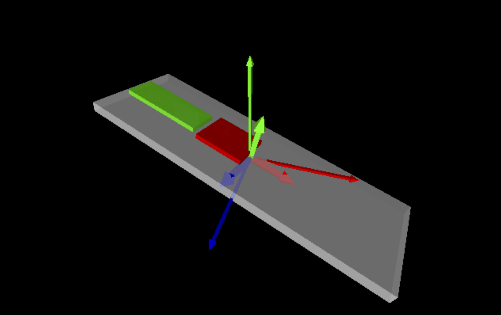

# bno08x-i2c-spi-micropython
## Micropython I2C SPI Library BNO08x Sensors for 9-axis Fusion

BNO08x MicroPython library for BNO086, BNO085, BNO080 IMUs (Inertial Memory Units) on I2C, SPI, UART. The 9-degree of freedom (9-DOF) BNO08x devices can provide indiviual sensor results in the reports that are enabled.

This library is written to efficiently provide high-frequency updates (short period). In addition, each resport has result timestamps with 0.1 msec resolution. 
Knowing IMU results together with timestamp of results is critical for many telemetry applications.  

This library requires that the int_pin and reset_pin be connected to the sensor.

This library has been tested with BNO086 sensor on Raspberry Pico 2 W microcontroller.
The report frequency can be limited by the interface chosen. SPI & UART are more efficient than I2C. 
BNO08x also uses I2C clock stretching which can cause issues on many microcontrollers

**Credits - Many thanks!**
- 100% inspired by the original Adafruit CircuitPython I2C library for BNO08x. Copyright (c) 2020 Bryan Siepert for Adafruit Industries. ([GitHub link](https://github.com/adafruit/Adafruit_CircuitPython_BNO08x))
- This code was also inspired by feature and fixes written by dobodu ([GitHub link](https://github.com/dobodu/BOSCH-BNO085-I2C-micropython-library))
- ...thanks in advance for any pull request contributions.

## Note: API change for Quaternion, and Euler in version 1.1 

[!NOTE]
In version 1.1, we changed the API for Quaternion & Euler parameters to match most other libraries including SparkFun & Adafruit.
However, please note that Adafruit and this implemebtion have the same pitch orientation, but Sparkfun's pitch is the negative value.
Also note that this "roll" in this library matches the silk screen on the Sparkfun sensor board, but Sparkfun and Adafruit are negatives of that.
Details are in the section at the end of this README.md

## Setting up the BNO08x Sensor

### I2C Setup

    from bno08x import *
    from i2c import BNO08X_I2C
    from machine import I2C, Pin

    int_pin = Pin(14, Pin.IN, Pin.PULL_UP)  # BNO sensor (INT)
    reset_pin = Pin(15, Pin.OUT)  # BNO sensor (RST)

    i2c0 = I2C(0, scl=Pin(13), sda=Pin(12), freq=400_000)
    bno = BNO08X_I2C(i2c0, address=0x4b, int_pin=int_pin, reset_pin=reset_pin)

Required for I2C (see SPI and UART below):
- address : each BNO08x needs a separate address (0x4b or 0x4a, depending on solder bump).
- int_pin : required for operation and also gives accurate sensor timestamps. Define a Pin object, not  number.
- reset_pin : required for operation after sensor power up. It is a Pin object, not number

Optional parameters:
- debug : prints very detailed logs, primarily for driver debug & development.

    bno = BNO08X_I2C(i2c0, address=0x4b, int_pin=int_pin, reset_pin=reset_pin, debug=True)

The maximum clock frequency for I2C is 400_000 (~400kbs). PS0 (wake_pin) and PS1 are used to select I2C.
To use I2C, both PS0 and PS1 can not have solder blobs which means both are tied to ground. I2C can not use wake_pin.

## Enable the Sensor Reports

Before getting a sensor report, each specific report must be enabled.

    bno.acceleration.enable()
    
Primary sensor report constants:

    bno.acceleration.enable()
    bno.linear_acceleration.enable()
    bno.magnetic.enable()
    bno.gyro.enable()
    bno.quaternion.enable()
    bno.geomagnetic_quaternion.enable()
    bno.game_quaternion.enable()
    
    bno.steps.enable()
    bno.stability_classifier.enable()
    bno.activity_classifier.enable()

## Getting the Sensor Results:

Sensors values can be read after you perform a bno.update_sensors. 
AVOID using sleep() in your loops, because senssors must be read quickly after updates. See example codes for better strategies.

    bno.update_sensors()
    accel_x, accel_y, accel_z = bno.acceleration

Yaw, pitch, and roll are obtained using quaternion with the modifier euler:

    bno.update_sensors()
    yaw, pitch, roll = bno.quaternion.euler

Beyond the sensor values, each update also has metadata with the timestamp of the reading and its accuracty. 
The sensor data and metadata for each report can be accessed at the same time using the modifier ".full".
In this way, the accuracy and the sub-microsecond-accurate timestamp of a particular report is returned at the same time.
The timestamp_ms is milliseconds since sensor startup. 
You can calculate the millisecond difference between ticks_ms() and the BNO08x start time by using bno.bno_start_diff.
Understanding timestamps is recommended for high-frequency applications (>5Hz).

    bno.update_sensors()
    accel_x, accel_y, accel_z, accuracy, timestamp_ms = bno.acceleration.full
    yaw, pitch, roll, accuracy, timestamp_ms = bno.quaternion.euler_full   # note underscore in .euler_full
    ms_since_sensor_start = bno.bno_start_diff(ticks_ms())
    print(f"milliseconds from bno start: {ms_since_sensor_start} msec")

The metadata (accuracy, timestamp) can be separately accessed, but due to timing of the calls they may be from a different report.
Using .full is recommended.

    accuracy, timestamp_ms = bno.acceleration.meta

If you are using quaternions and want to convert to an euler angle (degrees), the following conversion function cna be used.
Euler angles use the common Android robotics convention (Z-Y-X rotation order: yaw-pitch-roll).

    r, i, j, k = bno.quaternion
    # ...various quaternion processing
    yaw, pitch, roll = euler_conversion(new_r, new_i, new_j, new_k)

**Examples of other sensor reports**

The examples directory shows the use of the following sensor reports. Each of these functions use on-chip sensor fusion for accuracy.

    x, y, z = bno.acceleration          # acceleration 3-tuple of float returned (gravity direction included)
    x, y, z = bno.linear_acceleration   # linear accel 3-tuple of float returned
    x, y, z = bno.gyro                  # gryoscope 3-tuple of float returned
    x, y, z = bno.magnetic              # magnetic 3-tuple of float returned
    x, y, z = bno.gravity               # gravity vector 3-tuple of float returned
    yaw, pitch, roll = bno.quaternion.euler     # rotation degree angle in Euler orientation 3-tuple of float returned

    qr, qi, qj, qk = bno.quaternion              # rotation 4-tuple of float returned
    qr, qi, qj, qk = bno.geomagnetic_quaternion  # rotation 4-tuple of float returned
    qr, qi, qj, qk = bno.game_quaternion         # rotation 4-tuple of float returned

    num = bno.steps                             # number of steps since sensor initialization returned
    stability_str = bno.stability_classifier    # string of stability classification returned
    activity_str, conf = bno.activity_classifier    # string of activity classification, and integer %conf returned

The following can be used as the basis to tare the sensor (details  in references):
-   0: quaternion
-   1: game_quaternion
-   2: geomagnetic_quaternion
Typically, you want to tare on all axis and will specify this with 0x07.

    basis = 0 # quaternions
    axies = 0x07  # all axies
    bno.tare(axies,basis)
    bno.save_tare_data()

One can manually calibrate the sensor (details  in references):

    bno.begin_calibration() 
    bno.calibration_status()  # wait for sensor to be ready to calibrate
    # loop to test acceleration, magnetic, gyro  - see examples/test_calibration.py
    bno.save_calibration_data()

tare_reorientation can be used to set the sensor board orientation, for example if are mounting board vertically, or if you want a different part of the sensor to be "forward".

    qr, qi, qj, qk = bno.quaternion   # rotation 4-tuple of float returned
    # perform calcuations to transform tuple for your direction to tare on, then set, and save (see references below)
    bno.tare_reorientation(qr, qi, qj, qk)
    bno.save_tare_data()

We also supply the following conversion helper function:

    rx, ry, rz = bno.gyro  # results in Radians per second
    dx, dy, dz = bno.degree_conversion(rx, ry, rz)  # results in Degrees per second

## Option to Change Sensor Report Frequency

The default sensor update frequencies are 10 to 20 Hz.
You can request different frequecies and the BNO08x will pick the closest frequency it can provide. See (_Details on Report Frequencies_) for more details.

    bno.acceleration.enable(40)  # enable accelerometer reports at 40 Hertz (can also use 40.0)

## Sensor reports - next iteration

Each reading of sensor report will return the most recent value. To check for new data, use the .updated modifier for any sensor call, then get the value.

    bno.update_sensors()
    if bno.quaternion.updated:
        quat_i, quat_j, quat_k, quat_real, acc, ts_ms = bno.quaternion.full

    if bno.gyro.updated:
        gyro_x, gyro_y, gyro_z, acc, ts_ms = bno.gyro.full

The bno.update_sensors() returns the number of sensor reports received since the last call.
This count includes all enabled sensors and repeated updates from the same sensor.
Only the most recent report for each sensor is stored and returned.

## Euler Angles, Gimbal Lock, and Quaternions

Euler angle conventions: 

This library uses the Robotics / Android ENU convention (East, North, Up). A stationary sensor “feels” gravity +1g along the Z-axis.
Rotation sequence: Z-Y-X (commonly called Yaw-Pitch-Roll). 
Axes orientation, all are right-handed:
- Z points Up, toward the sky.
- Y points North.
- X points East, roll is meased around x-axis

Positive roll is seen on a CCW roll which is alighed with the silkscreen on the Sensor board.
Pitch and yaw signs match the ENU convention. Yaw increaes with CCW from above.  Yaw alighed with the silkscreen on the Sensor board.
Cartesian alignment: X points right, Y points forward, consistent with standard school Cartesian graphs.

The other common convention is Aerospace / NED (North, East, Down). A stationary sensor “feels” gravity -1g along the Z-axis.
Axes orientation:
- X points North.
- Y points East.
- Z points Down, into the Earth.
Roll, pitch, and yaw are defined relative to aircraft axes.
Yaw corresponds directly to compass heading: 0° = North, 90° = East. Yaw increaes with CW from above.
Preferred for aviation and navigation applications.

Euler angles suffer from a well-known issue called Gimbal Lock. Using Quaternions in code avoids this.
Gimbal lock occurs when two rotation axes align, which removes one degree of freedom. When a degree of freedom is
lost, some orientations will have multiple valid representations.
A well-known example occurred during the Apollo 11 mission.

Quaternions avoid this by providing a unique representation for every possible orientation. We use the standard ordering (qr, qi, qj, qk).
Most computer games are implemented with quaternions for smooth and predictable graphics.

- https://base.movella.com/s/article/Understanding-Gimbal-Lock-and-how-to-prevent-it?language=en_US
- https://en.wikipedia.org/wiki/Gimbal_lock
- https://en.wikipedia.org/wiki/Quaternions_and_spatial_rotation
- https://www.youtube.com/watch?v=zjMuIxRvygQ

## I2C Clock-stretch Issues on BNO08x and Communication Errors

Unfortunately, the BNO080, BNO085, and BNO086 all use **_non-standard clock stretching_** on I2C.
This causes a variety of issues including report errors and the need to restart/reset the sensor if the microcontroller has not responded quickly enough.
This library has been optimized for efficiency and should minimize clock stretching.
Clock stretching interferes with various microcontrollers (ex: RP2) in different ways (BNO08x Datasheet 1000-3927 v1.17, page 15).

## SPI Setup - High Speed & Stable (No Clock-Stretch Issues)

SPI should be set to baudrate=3000000.

In order to use SPI on most sensor boards you must add ONE solder blob on PS1. 
On the back side of Sparkfun BNO086 and Adafruit BNO085, you need a solder blob to bridge PS1 which will set PS1 high for SPI operation. 
The PS0 (Wake_pin) must be connected to a gpio (wake_pin), please be careful not put a solder blog on PS0.
This driver uses the wake-pin after reset as a ‘wake’ signal taking the BNO08x out of sleep for communication with the BNO08X.
On the Sparkfun BNO086 when using SPI, you must clear I2C jumper when using SPI or UART (https://docs.sparkfun.com/SparkFun_VR_IMU_Breakout_BNO086_QWIIC/assets/board_files/SparkFun_VR_IMU_Breakout_BNO086_QWIIC_Schematic_v10.pdf)

    from bno08x import *
    from i2c import BNO08X_I2C
    from machine import I2C, Pin

    int_pin = Pin(14, Pin.IN, Pin.PULL_UP)  # BNO sensor (INT)
    reset_pin = Pin(15, Pin.OUT)  # BNO sensor (RST)
    cs_pin = Pin(17, Pin.OUT)  # cs for SPI (CS)
    wake_pin = Pin(20, Pin.OUT, value=1)  # BNO sensor (WAK)

    spi = SPI(0, baudrate=3000000, sck=Pin(18), mosi=Pin(19), miso=Pin(16))
    bno = BNO08X_SPI(spi, cs_pin=cs_pin, int_pin=int_pin, reset_pin=reset_pin, wake_pin=wake_pin)
    print(spi)

Required for SPI:
- int_pin : required for accurate sensor timestamps. It is a Pin object, not number.
- reset_pin: requiews for hardware reset. It is a Pin object, not number.
- wake_pin : required for SPI operation. It is a Pin object, not number.
- cs_pin : required for SPI operation. It is a Pin object, not number.

Optional for SPI:
- debug : prints very detailed logs, primarily for driver debug & development.

This driver will reset the SPI to have polarity=1 and phase=1 as required by the BNO08x.

## UART Setup

 UART must be set to baudrate=3_000_000 (only).

PS0 and PS1 are the BNO08x interface protocol selection pins, therefore UART can not use a wake pin.  In order to use UART, PS1 must be high (solder blob) and PS0/WAKE not have solder blob so it is tied to ground. 
Must clear I2C jumper when using SPI or UART (https://docs.sparkfun.com/SparkFun_VR_IMU_Breakout_BNO086_QWIIC/assets/board_files/SparkFun_VR_IMU_Breakout_BNO086_QWIIC_Schematic_v10.pdf)

    from bno08x import *
    from i2c import BNO08X_I2C
    from machine import I2C, Pin
    
    int_pin = Pin(14, Pin.IN, Pin.PULL_UP)  # Interrupt, BNO (RST) signals when ready
    reset_pin = Pin(15, Pin.OUT, value=1)  # Reset, tells BNO (INT) to reset

    uart = UART(1, baudrate=3000000, tx=Pin(8), rx=Pin(9), timeout=500)
    bno = BNO08X_UART(uart, reset_pin=reset_pin, int_pin=int_pin, debug=False)

UART wires are, in some sense, opposite of I2C wires (double-check your wiring).
uart = UART(1, baudrate=3000000, tx=Pin(8), rx=Pin(9), timeout=2000)
uart = UART(0, baudrate=3000000, tx=Pin(12), rx=Pin(13), timeout=2000)

Required for UART:
- int_pin : required for accurate sensor timestamps. It is a Pin object, not number.
- reset_pin: requiews for hardware reset. It is a Pin object, not number.

## Details on Report Frequencies

Report frequencies should be enabled before requesting reports in the code.
To convert from period in ms to Hz (1000000/period_ms).

    bno.enable_feature(BNO_REPORT_ACCELEROMETER, 100)  # Enable accelerometer reports at 100 Hertz

When the frequency of the sensor is set in enable_feature, it should be viewed as a "suggestion" to the sensor to operate at that frequency.
If the sensor cannot operate at requested period, it may operate faster or slower (SH-2 datasheet 5.4.1 Rate Control).
For example, we've seen a request of 100 Hz and have had the sensor report at 125Hz.
With multiple reports we've also seen 20 Hz changed to 10 Hz.

| **Feature**             | ** BNO086 responses to Hz we've seen**                       |
|-------------------------|--------------------------------------------------------------|
| Composite Gyro Rotation |                                                              |
| Quaternion              | 1000, 500, 400, 250, 200, 100, 50, 25, 20, 10, 7.7, 5, 4,... |
| Gyroscope               | 1000, 500, 400, 200, 100, 50, 25, 20, 10, 7.7, 5, 4,...      |
| Accelerometer           | 500, 250, 125, 62.5, 31.3, 15.6, 7.8, 5.2,...                |
| Magnetometer            | 100, 76.9, 50, 25, 20, 10, 7.5, 5, 4, ...                    |
| Game Quaternion         |                                                              |
| Gravity                 |                                                              |
| Linear Acceleration     |                                                              |
| Geomagnetic Quaternion  |                                                              |
| raw Gyroscope           |                                                              |
| raw Magnetometer        |                                                              |
| raw Accelerometer       |                                                              |
| (report default)        |                                                              |

There is also a print function (slow) that shows all enabled reports by printing to the console.

    bno.print_report_period()

You can also access the values of each report period independently.
When you enable the feature, a float is returned with the frequency that the sensor will use to update the reports.
The actual sensor period will vary from the attempted period returned by this function.

    accelerometer_hertz = bno.acceleration.enable()
    period_ms = (1.0 / accelerometer_hertz) * 1000.0
    print(f"Accelerometer: {period_ms:.1f} ms, {accelerometer_hertz:.1f} Hz")

When you request report frequencies at faster than the Microcontroller can read from the sensor, the reporting frequency will slow.
It is recommended that the requested sensor rate matches your application's needs. In addition, only enable the sensors that you need.
Try you own experiments and let me know what you find.

| **Hz** | **ms** | **I2C/Quat** | **I2C/Acc** | **SPI/Quat** | **SPI/Acc** |
|--------|--------|--------------|-------------|--------------|-------------|
| 1000   | 1.0    | 6.1          | -           | 3.7          | -           |
| 500    | 2.0    | 6.9          | 2.0         | 5.2          | 2.0         |
| 400    | 2.5    | 2.9          | -           | 2.5          | -           |
| 250    | 4.0    | -            | 4.0         | -            | 4.0         |
| 200    | 5.0    | 5.1          | -           | 5.0          | -           |
| 125    | 8.0    | -            | 7.9         | -            | 8.0         |
| 100    | 10.0   | 10.0         | -           | 10.0         | -           |

Refer to the BNO080_085-Datasheet.pdf (page 50) for maximum sensor report rates by report type.

## Basic User Sensor Calibration Procedure - Dynamic Calibration

It is recommended to calibrate the BNO08x. Each sensor is calibrated individually.
The basic calibarationsteps are provided below if a user wants to force a calibration.
the basic Sensor Calibration Procedure:
- Accelerometer
- - Move sensor into 4-6 unique orientations and held in each orientation for about 1 second.
- - For planar calibration, rotated the sensor around it Z-axis by at least 180 degrees.
- Gyroscope
- - Set sensor down on a stationary surface for approximately 2-3 seconds.
- Magnetometer
- - Sensor should be rotated about 180° and back to the beginning position in each axis (yaw, pitch, roll). In roughly 2 seconds.

Background:
In the BNO08x datasheet see Figure 3-2 summarizes the steps required to calibrate the accelerometer, gyroscope and magnetometer.
Note that in normal use the device will be exposed to conditions that will allow calibration to
occur with no explicit user input.
For more details on the procedure to calibrate the BNO08x, refer to the BNO08x Sensor Calibration Procedure
application note.
- https://cdn.sparkfun.com/assets/9/e/1/d/9/Sensor-Calibration-Procedure-v1.1.pdf

## Sample use of library - output results to Vpython to show sensor orientation

I created a VPython code that runs on a Mac that reads data created on a Raspberry Pi Pico 2 W and a BNO086 sensor.
That code can be found here for Mac and RP Pico 2W that uses this library. 
VPython updates at 100 Frames/sec and sensor outputs Quaternions at 100 Hz (10ms).

https://github.com/bradcar/vpython_imu_tracker

## Raw Reports - Be Careful!
    BNO_REPORT_RAW_ACCELEROMETER
    BNO_REPORT_RAW_GYROSCOPE
    BNO_REPORT_RAW_MAGNETOMETER

The raw reports, which do not use sensor fusion calculations, can be accessed for acceleration,
magnetic, and gyro sensors. It is not generally recommended to use these reports, because they require signficant coding (careful
calibaration, Kalman filters, etc.). Starting background on Fusion algorithms: https://www.youtube.com/watch?v=0rlvvYgmTvI

Please read the references below before attempting to use raw reports. The raw sensors timestamps are not well-documented in Ceva documentation.

In addition, there are other sensor reports possible with the BNO08x sensors that this driver has not fully
implemented. See code source for details. 

## UART-RVC is NOT SUPPORTED by this driver (RVC, Robot Vacuum Cleaners)

The BNO08x has a simplified UART-RVC interface for use on unmanned ground roving robot and robot vacuum cleaners (RVC).
This is a very different protocol and not supported in my driver. Take a look at: https://github.com/rdagger/micropython-bno08x-rvc

## Changes required if porting from Adafuit or SparkFun
Match Adafruit
- pitch = -pitch
- roll  = -roll
- yaw unchanged

Match SparkFun
- roll = -roll  
- yaw and pitch unchanged

## Warning: API change for Quaternion, and Euler in version 1.1 

In version 1.1, we changed the API for Quaternion & Euler parameters to match most other libraries including SparkFun & Adafruit.
However, please note that Adafruit and this implemebtion have the same pitch orientation, but Sparkfun's pitch is the negative value.
Also note that this "roll" in this library matches the silk screen on the Sparkfun sensor board, but Sparkfun and Adafruit are negatives of that.
Details are in the section at the end of this README.md

In version 1.0 of the library, the Quaternion functions were aligned with Ceva's internal SH2 definitions, which do not match most other libraries and codes parameter orderings.

Quaternion:

    v1.0 Ceva ordering: i, j, k, real = bno.quaternion
    v 1.1 Standard ordering: real, i, j, k, = bno.quaternion

In addition, in version 1.0 of the library, The Euler conversion math is Z-Y-X, but they are in a non-standard order.
This should be fixed. The current and future math uses Right-hand about +Z, Right-hand about +Y, Right-hand about +X.

Euler:

    v1.0 Euler Angles: roll, pitch, yaw = bno.quaternion.euler # Frame: ENU
    v1.1 Euler angles: yaw, pitch, roll = bno.quaternion.euler # Frame: ENU with Rotation calculation order: Z → Y → X

## References

The CEVA BNO085 and BNO086 9-axis sensors are made by Ceva (https://www.ceva-ip.com). These sensors are based on Bosch hardware but use Hillcrest Labs’ proprietary sensor fusion software. BNO086 is backwards compatible with BNO085 and both are pin-for-pin replacements for Bosch Sensortec’s discontinued BNO055 and BMF055 sensors.

- https://www.ceva-ip.com/wp-content/uploads/BNO080_085-Product-Brief.pdf
- https://www.ceva-ip.com/wp-content/uploads/BNO080_085-Datasheet.pdf
- https://cdn.sparkfun.com/assets/4/d/9/3/8/SH-2-Reference-Manual-v1.2.pdf
- https://cdn.sparkfun.com/assets/7/6/9/3/c/Sensor-Hub-Transport-Protocol-v1.7.pdf
- https://docs.sparkfun.com/SparkFun_VR_IMU_Breakout_BNO086_QWIIC/assets/component_documentation/BNO080-BNO085-Tare-Function-Usage-Guide.pdf

Bosch has a new 6-axis IMU BHI385 (announced June 2025) that can be paired with BMM350 3-axis Geomagnetic sensor.
